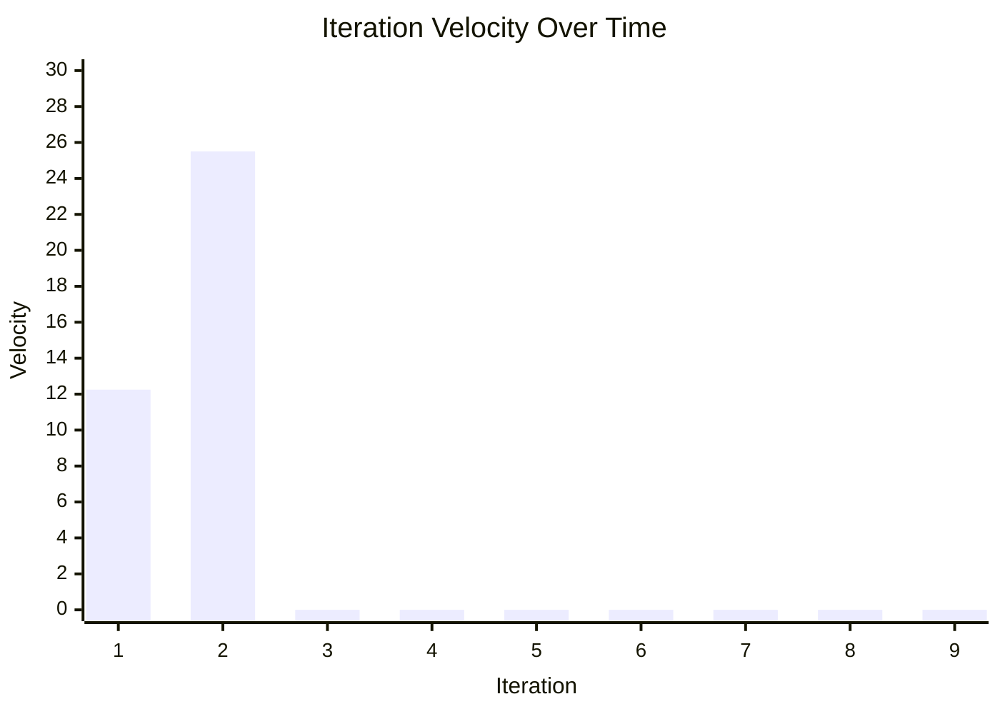

# Iteration Stats

The ZAPP Developer and Curation team work in two week iterations. You can see the detailed management plan in the [Requirements Repo Readme](https://github.com/zappfish/zapp-requirements-tracker/blob/main/README.md). For details on the tickets completed during each iteration, go to the [task tracker project board](https://github.com/orgs/zappfish/projects/1/views/13).  
- [Priority 1 Requirements](https://github.com/orgs/zappfish/projects/2/views/15) are the teams main focus from February 18, 2026 to present.
- [Priority 2 Requirements](https://github.com/orgs/zappfish/projects/2/views/16)
- [Priroty 3 Requirements](https://github.com/orgs/zappfish/projects/2/views/17)

**Total Developer/Curator Team FTE per iteration as of March 1, 2026:** 14.5 days

## Task ticket sizing 
| Ticket Size | ~ # of days to complete|
| -- | -- |
| XS | <1 day |
|S | 1 day|
|M | 2-3 days|
|L | 4-5 days|
|XL | 6-10 days|

## Iteration Stats and Approximate Velocity
| Iteration Number | Iteration Start Date | Iteration End Date | XS | S | M | L | XL | ~ Velocity (days) |
| -- | -- | -- | -- | -- |--  | -- |--  |--|
| 1 | February 18, 2026 | March 3, 2026  | 1 |0  |1  |2  |0  | 10.5-14
| 2 | March 4, 2026 | March 17, 2026  | 2 | 4 | 5 | 0 | 1 | 21-30
| 3 | March 18, 2026 | March 31, 2026  |  |  |  |  |  |
| 4 | April 1, 2026 | April 14, 2026  |  |  |  |  |  |
| 5 | April 15, 2026 | April 28, 2026  |  |  |  |  |  |
| 6 | April 29, 2026 | May 12, 2026  |  |  |  |  |  |
| 7 | May 13, 2026 | May 26, 2026  |  |  |  |  |  |
| 8 | May 27, 2026 | June 9, 2026  |  |  |  |  |  |
| 9 | June 10, 2026 | June 23, 2026  |  |  |  |  |  |

