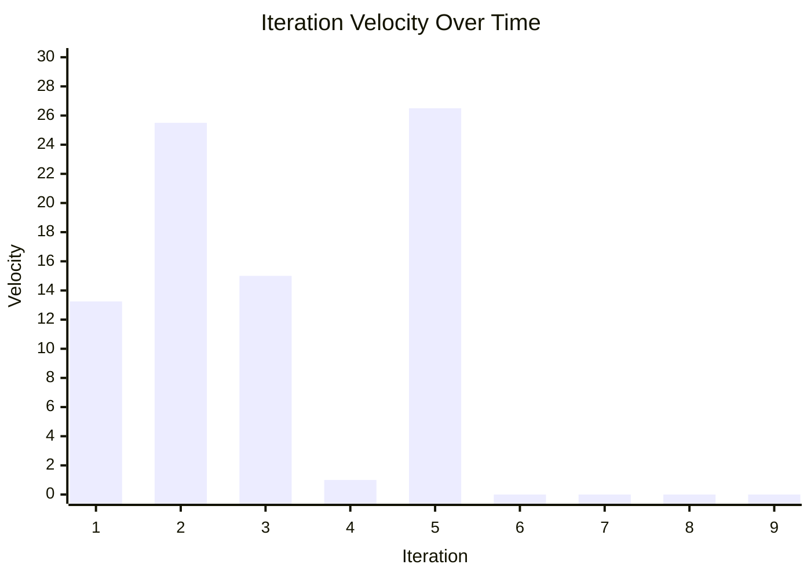

# Iteration Stats

The ZAPP Developer and Curation team work in two week iterations. You can see the detailed management plan in the [Requirements Repo Readme](https://github.com/zappfish/zapp-requirements-tracker/blob/main/README.md). For details on the tickets completed during each iteration, go to the [task tracker project board](https://github.com/orgs/zappfish/projects/1/views/13).  
- [Priority 1 Requirements](https://github.com/orgs/zappfish/projects/2/views/15) are the teams main focus from February 18, 2026 to June 1, 2026.
- [Priority 2 Requirements](https://github.com/orgs/zappfish/projects/2/views/16) will continue in June 2026.
- [Priroty 3 Requirements](https://github.com/orgs/zappfish/projects/2/views/17)

**Total Developer/Curator Team FTE per iteration as of March 1, 2026:** 14.5 days

## Task ticket sizing 
| Ticket Size | ~ # of days to complete|
| -- | -- |
| XS | <1 day |
|S | 1 day|
|M | 2-3 days|
|L | 4-5 days|
|XL | 6-10 days|

## Iteration Stats and Approximate Velocity
<table>
  <thead>
    <tr>
      <th>Iteration Number</th>
      <th>Iteration Start Date</th>
      <th>Iteration End Date</th>
      <th>XS</th>
      <th>S</th>
      <th>M</th>
      <th>L</th>
      <th>XL</th>
      <th>~ Velocity (days)</th>
    </tr>
  </thead>
  <tbody>
    <tr><td>1</td><td>February 18, 2026</td><td>March 3, 2026</td><td>1</td><td>1</td><td>1</td><td>2</td><td>0</td><td>11.5–15</td></tr>
    <tr><td>2</td><td>March 4, 2026</td><td>March 17, 2026</td><td>2</td><td>4</td><td>5</td><td>0</td><td>1</td><td>21–30</td></tr>
    <tr><td>3</td><td>March 18, 2026</td><td>March 31, 2026</td><td>2</td><td>3</td><td>1</td><td>0</td><td>1</td><td>12–18</td></tr>
    <tr><td>4</td><td>April 1, 2026</td><td>April 14, 2026</td><td>0</td><td>1</td><td>0</td><td>0</td><td>0</td><td>1</td></tr>
    <tr><td>5</td><td>April 15, 2026</td><td>April 28, 2026</td><td>0</td><td>2</td><td>3</td><td>2</td><td>1</td><td>22-31</td></tr>
    <tr><td>6</td><td>April 29, 2026</td><td>May 12, 2026</td><td></td><td></td><td></td><td></td><td></td><td></td></tr>
    <tr><td>7</td><td>May 13, 2026</td><td>May 26, 2026</td><td></td><td></td><td></td><td></td><td></td><td></td></tr>
    <tr><td colspan="9"><strong>Priority 1 Requirements Done / Priority 2 Requirements Start</strong></td></tr>
    <tr><td>8</td><td>May 27, 2026</td><td>June 9, 2026</td><td></td><td></td><td></td><td></td><td></td><td></td></tr>
    <tr><td>9</td><td>June 10, 2026</td><td>June 23, 2026</td><td></td><td></td><td></td><td></td><td></td><td></td></tr>
  </tbody>
</table>

