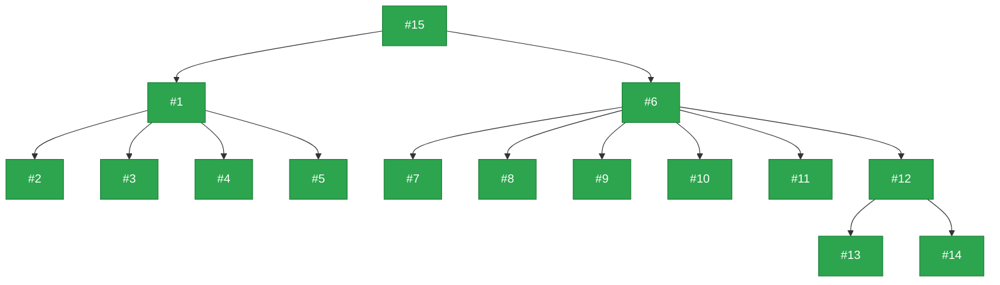
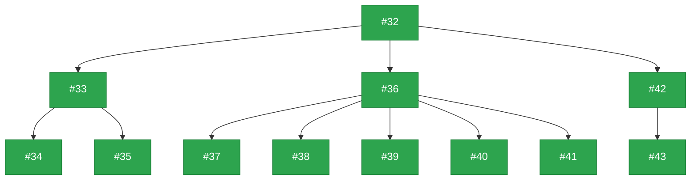
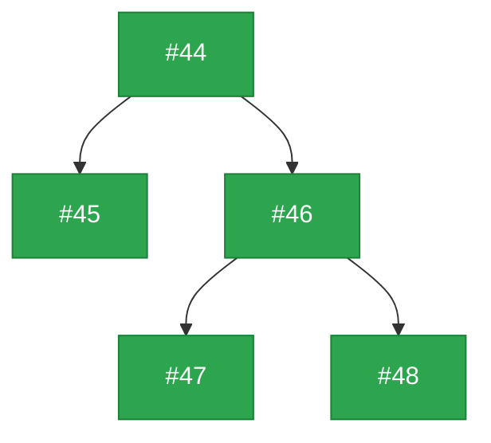
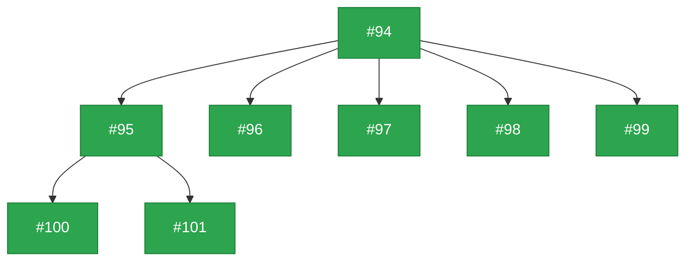

# ZAPP Requirements Tracker
Requirements tracker for the Zebrafish Phenotype Atlas Project

This repository is for tracking and planning requirements for ZAPP. A project board version of this repo is found [here](https://github.com/orgs/zappfish/projects/2/views/6).

**Project Title:** Advancing a community-led zebrafish toxicology phenotype atlas  
**Grant Number:** NIEHS 1R24ES036130  
**Grant Start Date:** July 23, 2024  
**Grant End Date:** June 30, 2029  
**Primary Contacts:** Sabrina Toro (contact) and Alexa Burger  

⭐ Note: This repo should only be used for planning detailed steps to achieve a requirement and reporting on progress. ⭐  
All actual project work should live in the appropriate repository such as:

- https://github.com/zappfish/frogpot
- https://github.com/zappfish/phenotype-picker
- https://github.com/zappfish/zebrafish-toxicology-atlas-schema
- https://github.com/zappfish/zapp-atlas
- https://github.com/zappfish/zappfish.github.io

---

## Status Color Legend

> Box colors in the WBS diagrams below match the status colors from the [ZAPP Requirements Project Board](https://github.com/orgs/zappfish/projects/2/views/6).

## Work Breakdown Structure

### Overview

```mermaid
graph TD
    ZAPP["ZAPP"]

    R1["#16"]:::backlog
    R2["#15"]:::backlog
    R3["#32"]:::backlog
    R4["#44"]:::backlog
    R5["#49"]:::backlog
    R6["#72"]:::backlog
    R7["#94"]:::backlog

    ZAPP --> R1 & R2 & R3 & R4 & R5 & R6 & R7

    R1A["#17"]:::backlog
    R1B["#26"]:::backlog
    R1 --> R1A & R1B

    R2A["#1"]:::backlog
    R2B["#6"]:::backlog
    R2 --> R2A & R2B

    R3A["#33"]:::backlog
    R3B["#36"]:::backlog
    R3C["#42"]:::backlog
    R3 --> R3A & R3B & R3C

    R4A["#45"]:::backlog
    R4B["#46"]:::backlog
    R4 --> R4A & R4B

    R5A["#50"]:::backlog
    R5B["#51"]:::backlog
    R5C["#67"]:::backlog
    R5D["#70"]:::backlog
    R5 --> R5A & R5B & R5C & R5D

    R6A["#73"]:::backlog
    R6B["#74"]:::backlog
    R6C["#75"]:::backlog
    R6D["#76"]:::backlog
    R6E["#77"]:::backlog
    R6 --> R6A & R6B & R6C & R6D & R6E

    R7A["#95"]:::backlog
    R7B["#96"]:::backlog
    R7C["#97"]:::backlog
    R7D["#98"]:::backlog
    R7E["#99"]:::backlog
    R7 --> R7A & R7B & R7C & R7D & R7E

    click R1 href "https://github.com/zappfish/zapp-requirements-tracker/issues/16" _blank
    click R2 href "https://github.com/zappfish/zapp-requirements-tracker/issues/15" _blank
    click R3 href "https://github.com/zappfish/zapp-requirements-tracker/issues/32" _blank
    click R4 href "https://github.com/zappfish/zapp-requirements-tracker/issues/44" _blank
    click R5 href "https://github.com/zappfish/zapp-requirements-tracker/issues/49" _blank
    click R6 href "https://github.com/zappfish/zapp-requirements-tracker/issues/72" _blank
    click R7 href "https://github.com/zappfish/zapp-requirements-tracker/issues/94" _blank
    click R1A href "https://github.com/zappfish/zapp-requirements-tracker/issues/17" _blank
    click R1B href "https://github.com/zappfish/zapp-requirements-tracker/issues/26" _blank
    click R2A href "https://github.com/zappfish/zapp-requirements-tracker/issues/1" _blank
    click R2B href "https://github.com/zappfish/zapp-requirements-tracker/issues/6" _blank
    click R3A href "https://github.com/zappfish/zapp-requirements-tracker/issues/33" _blank
    click R3B href "https://github.com/zappfish/zapp-requirements-tracker/issues/36" _blank
    click R3C href "https://github.com/zappfish/zapp-requirements-tracker/issues/42" _blank
    click R4A href "https://github.com/zappfish/zapp-requirements-tracker/issues/45" _blank
    click R4B href "https://github.com/zappfish/zapp-requirements-tracker/issues/46" _blank
    click R5A href "https://github.com/zappfish/zapp-requirements-tracker/issues/50" _blank
    click R5B href "https://github.com/zappfish/zapp-requirements-tracker/issues/51" _blank
    click R5C href "https://github.com/zappfish/zapp-requirements-tracker/issues/67" _blank
    click R5D href "https://github.com/zappfish/zapp-requirements-tracker/issues/70" _blank
    click R6A href "https://github.com/zappfish/zapp-requirements-tracker/issues/73" _blank
    click R6B href "https://github.com/zappfish/zapp-requirements-tracker/issues/74" _blank
    click R6C href "https://github.com/zappfish/zapp-requirements-tracker/issues/75" _blank
    click R6D href "https://github.com/zappfish/zapp-requirements-tracker/issues/76" _blank
    click R6E href "https://github.com/zappfish/zapp-requirements-tracker/issues/77" _blank
    click R7A href "https://github.com/zappfish/zapp-requirements-tracker/issues/95" _blank
    click R7B href "https://github.com/zappfish/zapp-requirements-tracker/issues/96" _blank
    click R7C href "https://github.com/zappfish/zapp-requirements-tracker/issues/97" _blank
    click R7D href "https://github.com/zappfish/zapp-requirements-tracker/issues/98" _blank
    click R7E href "https://github.com/zappfish/zapp-requirements-tracker/issues/99" _blank

    classDef backlog fill:#2da44e,stroke:#1a7f37,color:#fff
    classDef upnext fill:#0969da,stroke:#0550ae,color:#fff
    classDef inprogress fill:#bf8700,stroke:#9a6700,color:#fff
    classDef inreview fill:#8250df,stroke:#6639ba,color:#fff
    classDef stable fill:#bf3989,stroke:#99306f,color:#fff
    classDef done fill:#bc4c00,stroke:#953800,color:#fff
```

### 1: Data Model

```mermaid
graph TD
    R1["#16"]:::backlog

    R1A["#17"]:::backlog
    R1B["#26"]:::backlog
    R1 --> R1A & R1B

    R1A1["#18"]:::backlog
    R1A2["#19"]:::backlog
    R1A3["#20"]:::backlog
    R1A4["#21"]:::backlog
    R1A5["#22"]:::backlog
    R1A6["#23"]:::inprogress
    R1A7["#24"]:::inprogress
    R1A8["#25"]:::inprogress
    R1A --> R1A1 & R1A2 & R1A3 & R1A4 & R1A5 & R1A6 & R1A7 & R1A8

    R1B1["#27"]:::backlog
    R1B2["#28"]:::backlog
    R1B3["#29"]:::backlog
    R1B4["#30"]:::backlog
    R1B5["#31"]:::backlog
    R1B --> R1B1 & R1B2 & R1B3 & R1B4 & R1B5

    click R1 href "https://github.com/zappfish/zapp-requirements-tracker/issues/16" _blank
    click R1A href "https://github.com/zappfish/zapp-requirements-tracker/issues/17" _blank
    click R1B href "https://github.com/zappfish/zapp-requirements-tracker/issues/26" _blank
    click R1A1 href "https://github.com/zappfish/zapp-requirements-tracker/issues/18" _blank
    click R1A2 href "https://github.com/zappfish/zapp-requirements-tracker/issues/19" _blank
    click R1A3 href "https://github.com/zappfish/zapp-requirements-tracker/issues/20" _blank
    click R1A4 href "https://github.com/zappfish/zapp-requirements-tracker/issues/21" _blank
    click R1A5 href "https://github.com/zappfish/zapp-requirements-tracker/issues/22" _blank
    click R1A6 href "https://github.com/zappfish/zapp-requirements-tracker/issues/23" _blank
    click R1A7 href "https://github.com/zappfish/zapp-requirements-tracker/issues/24" _blank
    click R1A8 href "https://github.com/zappfish/zapp-requirements-tracker/issues/25" _blank
    click R1B1 href "https://github.com/zappfish/zapp-requirements-tracker/issues/27" _blank
    click R1B2 href "https://github.com/zappfish/zapp-requirements-tracker/issues/28" _blank
    click R1B3 href "https://github.com/zappfish/zapp-requirements-tracker/issues/29" _blank
    click R1B4 href "https://github.com/zappfish/zapp-requirements-tracker/issues/30" _blank
    click R1B5 href "https://github.com/zappfish/zapp-requirements-tracker/issues/31" _blank

    classDef backlog fill:#2da44e,stroke:#1a7f37,color:#fff
    classDef upnext fill:#0969da,stroke:#0550ae,color:#fff
    classDef inprogress fill:#bf8700,stroke:#9a6700,color:#fff
    classDef inreview fill:#8250df,stroke:#6639ba,color:#fff
    classDef stable fill:#bf3989,stroke:#99306f,color:#fff
    classDef done fill:#bc4c00,stroke:#953800,color:#fff
```

### 2: Ontologies / External IDs

### 3: Data Storage / Retrieval

### 4: Publish Data

### 5: Data Input / Submission

```mermaid
graph TD
    R5["#49"]:::backlog

    R5A["#50"]:::backlog
    R5B["#51"]:::backlog
    R5C["#67"]:::backlog
    R5D["#70"]:::backlog
    R5 --> R5A & R5B & R5C & R5D

    R5B1["#52"]:::backlog
    R5B2["#53"]:::backlog
    R5B3["#54"]:::backlog
    R5B4["#55"]:::backlog
    R5B5["#56"]:::backlog
    R5B6["#57"]:::backlog
    R5B7["#58"]:::backlog
    R5B8["#59"]:::backlog
    R5B9["#60"]:::backlog
    R5B10["#61"]:::backlog
    R5B11["#62"]:::backlog
    R5B12["#63"]:::backlog
    R5B13["#64"]:::backlog
    R5B14["#65"]:::backlog
    R5B15["#66"]:::backlog
    R5B --> R5B1 & R5B2 & R5B3 & R5B4 & R5B5 & R5B6 & R5B7 & R5B8
    R5B --> R5B9 & R5B10 & R5B11 & R5B12 & R5B13 & R5B14 & R5B15

    R5C1["#68"]:::backlog
    R5C2["#69"]:::backlog
    R5C --> R5C1 & R5C2

    click R5 href "https://github.com/zappfish/zapp-requirements-tracker/issues/49" _blank
    click R5A href "https://github.com/zappfish/zapp-requirements-tracker/issues/50" _blank
    click R5B href "https://github.com/zappfish/zapp-requirements-tracker/issues/51" _blank
    click R5C href "https://github.com/zappfish/zapp-requirements-tracker/issues/67" _blank
    click R5D href "https://github.com/zappfish/zapp-requirements-tracker/issues/70" _blank
    click R5B1 href "https://github.com/zappfish/zapp-requirements-tracker/issues/52" _blank
    click R5B2 href "https://github.com/zappfish/zapp-requirements-tracker/issues/53" _blank
    click R5B3 href "https://github.com/zappfish/zapp-requirements-tracker/issues/54" _blank
    click R5B4 href "https://github.com/zappfish/zapp-requirements-tracker/issues/55" _blank
    click R5B5 href "https://github.com/zappfish/zapp-requirements-tracker/issues/56" _blank
    click R5B6 href "https://github.com/zappfish/zapp-requirements-tracker/issues/57" _blank
    click R5B7 href "https://github.com/zappfish/zapp-requirements-tracker/issues/58" _blank
    click R5B8 href "https://github.com/zappfish/zapp-requirements-tracker/issues/59" _blank
    click R5B9 href "https://github.com/zappfish/zapp-requirements-tracker/issues/60" _blank
    click R5B10 href "https://github.com/zappfish/zapp-requirements-tracker/issues/61" _blank
    click R5B11 href "https://github.com/zappfish/zapp-requirements-tracker/issues/62" _blank
    click R5B12 href "https://github.com/zappfish/zapp-requirements-tracker/issues/63" _blank
    click R5B13 href "https://github.com/zappfish/zapp-requirements-tracker/issues/64" _blank
    click R5B14 href "https://github.com/zappfish/zapp-requirements-tracker/issues/65" _blank
    click R5B15 href "https://github.com/zappfish/zapp-requirements-tracker/issues/66" _blank
    click R5C1 href "https://github.com/zappfish/zapp-requirements-tracker/issues/68" _blank
    click R5C2 href "https://github.com/zappfish/zapp-requirements-tracker/issues/69" _blank

    classDef backlog fill:#2da44e,stroke:#1a7f37,color:#fff
    classDef upnext fill:#0969da,stroke:#0550ae,color:#fff
    classDef inprogress fill:#bf8700,stroke:#9a6700,color:#fff
    classDef inreview fill:#8250df,stroke:#6639ba,color:#fff
    classDef stable fill:#bf3989,stroke:#99306f,color:#fff
    classDef done fill:#bc4c00,stroke:#953800,color:#fff
```

### 6: Atlas / Atlas UI

```mermaid
graph TD
    R6["#72"]:::backlog

    R6A["#73"]:::backlog
    R6B["#74"]:::backlog
    R6C["#75"]:::backlog
    R6D["#76"]:::backlog
    R6E["#77"]:::backlog
    R6 --> R6A & R6B & R6C & R6D & R6E

    R6C1["#78"]:::backlog
    R6C2["#79"]:::backlog
    R6C3["#80"]:::backlog
    R6C4["#81"]:::backlog
    R6C5["#82"]:::backlog
    R6C6["#83"]:::backlog
    R6C7["#84"]:::backlog
    R6C --> R6C1 & R6C2 & R6C3 & R6C4 & R6C5 & R6C6 & R6C7

    R6D1["#85"]:::backlog
    R6D2["#86"]:::backlog
    R6D3["#87"]:::backlog
    R6D4["#88"]:::backlog
    R6D5["#89"]:::backlog
    R6D --> R6D1 & R6D2 & R6D3 & R6D4 & R6D5

    R6E1["#90"]:::backlog
    R6E2["#91"]:::backlog
    R6E3["#92"]:::backlog
    R6E4["#93"]:::backlog
    R6E --> R6E1 & R6E2 & R6E3 & R6E4

    click R6 href "https://github.com/zappfish/zapp-requirements-tracker/issues/72" _blank
    click R6A href "https://github.com/zappfish/zapp-requirements-tracker/issues/73" _blank
    click R6B href "https://github.com/zappfish/zapp-requirements-tracker/issues/74" _blank
    click R6C href "https://github.com/zappfish/zapp-requirements-tracker/issues/75" _blank
    click R6D href "https://github.com/zappfish/zapp-requirements-tracker/issues/76" _blank
    click R6E href "https://github.com/zappfish/zapp-requirements-tracker/issues/77" _blank
    click R6C1 href "https://github.com/zappfish/zapp-requirements-tracker/issues/78" _blank
    click R6C2 href "https://github.com/zappfish/zapp-requirements-tracker/issues/79" _blank
    click R6C3 href "https://github.com/zappfish/zapp-requirements-tracker/issues/80" _blank
    click R6C4 href "https://github.com/zappfish/zapp-requirements-tracker/issues/81" _blank
    click R6C5 href "https://github.com/zappfish/zapp-requirements-tracker/issues/82" _blank
    click R6C6 href "https://github.com/zappfish/zapp-requirements-tracker/issues/83" _blank
    click R6C7 href "https://github.com/zappfish/zapp-requirements-tracker/issues/84" _blank
    click R6D1 href "https://github.com/zappfish/zapp-requirements-tracker/issues/85" _blank
    click R6D2 href "https://github.com/zappfish/zapp-requirements-tracker/issues/86" _blank
    click R6D3 href "https://github.com/zappfish/zapp-requirements-tracker/issues/87" _blank
    click R6D4 href "https://github.com/zappfish/zapp-requirements-tracker/issues/88" _blank
    click R6D5 href "https://github.com/zappfish/zapp-requirements-tracker/issues/89" _blank
    click R6E1 href "https://github.com/zappfish/zapp-requirements-tracker/issues/90" _blank
    click R6E2 href "https://github.com/zappfish/zapp-requirements-tracker/issues/91" _blank
    click R6E3 href "https://github.com/zappfish/zapp-requirements-tracker/issues/92" _blank
    click R6E4 href "https://github.com/zappfish/zapp-requirements-tracker/issues/93" _blank

    classDef backlog fill:#2da44e,stroke:#1a7f37,color:#fff
    classDef upnext fill:#0969da,stroke:#0550ae,color:#fff
    classDef inprogress fill:#bf8700,stroke:#9a6700,color:#fff
    classDef inreview fill:#8250df,stroke:#6639ba,color:#fff
    classDef stable fill:#bf3989,stroke:#99306f,color:#fff
    classDef done fill:#bc4c00,stroke:#953800,color:#fff
```

### 7: Governance

