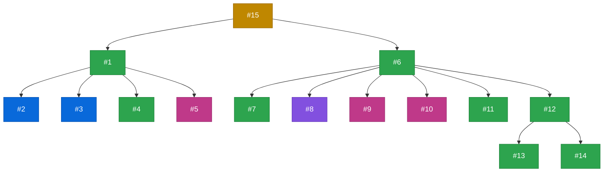
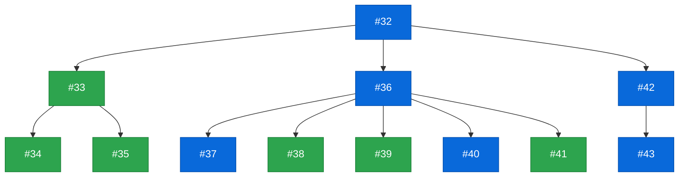
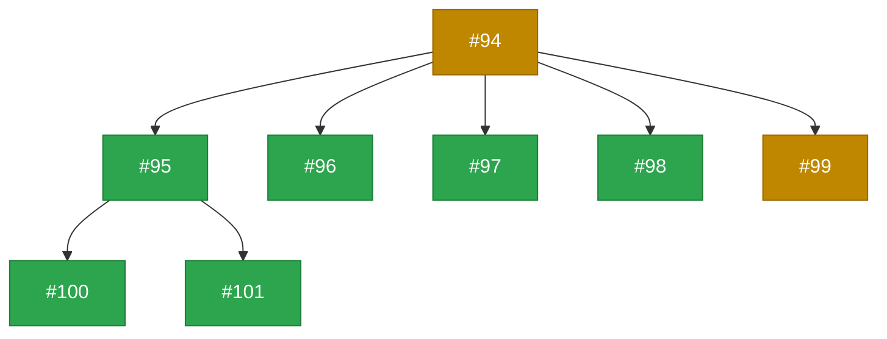
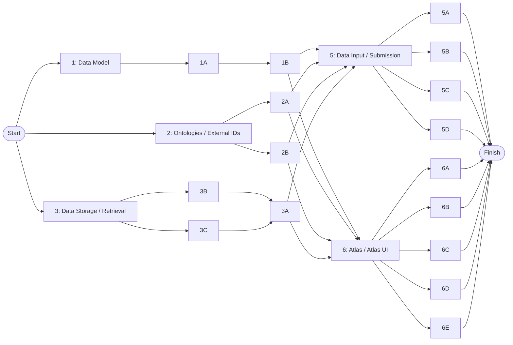

# ZAPP Requirements Tracker
Requirements tracker for the Zebrafish Phenotype Atlas Project

This repository is for tracking and planning requirements for ZAPP. A project board version of this repo is found [here](https://github.com/orgs/zappfish/projects/2/views/6).

**Project Title:** Advancing a community-led zebrafish toxicology phenotype atlas  
**Grant Number:** NIEHS 1R24ES036130  
**Grant Start Date:** July 23, 2024  
**Grant End Date:** June 30, 2029  
**Primary Contacts:** Sabrina Toro (contact) and Alexa Burger  

⭐ Note: This repo should only be used for planning detailed steps to achieve a requirement and reporting on progress. ⭐  
All actual project work should live in the appropriate repository such as:

- https://github.com/zappfish/frogpot
- https://github.com/zappfish/phenotype-picker
- https://github.com/zappfish/zebrafish-toxicology-atlas-schema
- https://github.com/zappfish/zapp-atlas
- https://github.com/zappfish/zappfish.github.io

---

## Work Breakdown Structure (WBS)
This project operates using a hybrid project management style. For a quick overview of requirements progress, see the WBS visuals below. Box colors in the WBS diagrams correspond to the status colors from the ZAPP Requirements Project Board and are updated approximately weekly. There are seven high-level requirements, each broken down into sub-requirements. These seven requirements, and their sub-requirements, have interdependencies that are factored into their prioritization for delivering a Submission Form and Atlas MVP (minimum viable product).

### Status Color Legend

### 1: Data Model

```mermaid
graph TD
    R1["#16"]:::inprogress

    R1A["#17"]:::stable
    R1B["#26"]:::backlog
    R1 --> R1A & R1B

    R1A1["#18"]:::stable
    R1A2["#19"]:::stable
    R1A3["#20"]:::stable
    R1A4["#21"]:::stable
    R1A5["#22"]:::stable
    R1A6["#23"]:::inprogress
    R1A7["#24"]:::inprogress
    R1A8["#25"]:::inprogress
    R1A --> R1A1 & R1A2 & R1A3 & R1A4 & R1A5 & R1A6 & R1A7 & R1A8

    R1B1["#27"]:::backlog
    R1B2["#28"]:::backlog
    R1B3["#29"]:::backlog
    R1B4["#30"]:::backlog
    R1B5["#31"]:::backlog
    R1B --> R1B1 & R1B2 & R1B3 & R1B4 & R1B5

    click R1 href "https://github.com/zappfish/zapp-requirements-tracker/issues/16" _blank
    click R1A href "https://github.com/zappfish/zapp-requirements-tracker/issues/17" _blank
    click R1B href "https://github.com/zappfish/zapp-requirements-tracker/issues/26" _blank
    click R1A1 href "https://github.com/zappfish/zapp-requirements-tracker/issues/18" _blank
    click R1A2 href "https://github.com/zappfish/zapp-requirements-tracker/issues/19" _blank
    click R1A3 href "https://github.com/zappfish/zapp-requirements-tracker/issues/20" _blank
    click R1A4 href "https://github.com/zappfish/zapp-requirements-tracker/issues/21" _blank
    click R1A5 href "https://github.com/zappfish/zapp-requirements-tracker/issues/22" _blank
    click R1A6 href "https://github.com/zappfish/zapp-requirements-tracker/issues/23" _blank
    click R1A7 href "https://github.com/zappfish/zapp-requirements-tracker/issues/24" _blank
    click R1A8 href "https://github.com/zappfish/zapp-requirements-tracker/issues/25" _blank
    click R1B1 href "https://github.com/zappfish/zapp-requirements-tracker/issues/27" _blank
    click R1B2 href "https://github.com/zappfish/zapp-requirements-tracker/issues/28" _blank
    click R1B3 href "https://github.com/zappfish/zapp-requirements-tracker/issues/29" _blank
    click R1B4 href "https://github.com/zappfish/zapp-requirements-tracker/issues/30" _blank
    click R1B5 href "https://github.com/zappfish/zapp-requirements-tracker/issues/31" _blank

    classDef backlog fill:#2da44e,stroke:#1a7f37,color:#fff
    classDef upnext fill:#0969da,stroke:#0550ae,color:#fff
    classDef inprogress fill:#bf8700,stroke:#9a6700,color:#fff
    classDef inreview fill:#8250df,stroke:#6639ba,color:#fff
    classDef stable fill:#bf3989,stroke:#99306f,color:#fff
    classDef done fill:#bc4c00,stroke:#953800,color:#fff
```

### 2: Ontologies / External IDs

### 3: Data Storage / Retrieval

### 4: Publish Data

### 5: Data Input / Submission

### 6: Atlas / Atlas UI

### 7: Governance

---

## Network Diagram

